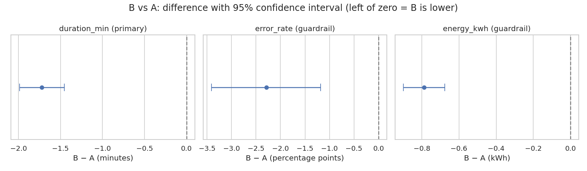

# A/B Test Readout: Robot Task-Allocation Algorithm A vs B

Should a robot fleet switch from task-allocation algorithm **A** to **B**? This project runs the comparison the way a product
analytics team would: primary metric and guardrails fixed up front, sanity checks before results, effect sizes with confidence
intervals, a power check, multiple-testing correction, and a written decision.



## Decision: ship B

| Metric | A | B | B − A (95% CI) | Relative | Holm-adjusted p |
|---|---|---|---|---|---|
| **Task duration, min** (primary) | 29.81 | 28.09 | **−1.72** (−1.99 to −1.45) | −5.8% | < 0.001 |
| Error rate (guardrail) | 5.30% | 3.01% | −2.29 pp (−3.41 to −1.18) | −43% | < 0.001 |
| Energy per task, kWh (guardrail) | 11.99 | 11.20 | −0.79 (−0.90 to −0.68) | −6.6% | < 0.001 |

Per 1,000 tasks, B saves about **1,720 robot-minutes**, **23 errors** and **790 kWh**.

## How the conclusion was checked

- **Sample ratio mismatch:** 2,510 vs 2,490 tasks; chi-square p = 0.78, so the split is consistent with 50/50.
- **Balance:** task types are evenly spread across arms (p = 0.82), and all 100 robots ran both algorithms.
- **Power:** at this sample size the test could reliably detect (80% power) a duration change of 0.38 min. The observed 1.72 min is 4.5× that.
  For error rate the detectable change was about 1.6 pp, so the observed 2.3 pp drop is real but close to the limit, and worth monitoring after rollout.
- **Robustness:** a bootstrap confidence interval (−1.99 to −1.46 min) agrees with the Welch interval. A regression adjusting for task type gives −1.72 min, and B is faster for every task type (−1.4 to −2.0 min).
- **Multiple testing:** three metrics were tested, so p-values are Holm-adjusted.

**Caveat:** the task logs are simulated, so the numbers illustrate the method rather than a real fleet.

## Pipeline

The analysis was originally built on AWS; the notebook reproduces it locally with DuckDB standing in for Athena.

| Stage | AWS | Local equivalent |
|---|---|---|
| Storage | Amazon S3 | `robotic_task_logs.csv` |
| Catalog / ETL | AWS Glue | pandas |
| Query | Amazon Athena | DuckDB, same SQL (`sql/arm_summary.sql`) |
| Analysis | SageMaker notebook | `ab_test_readout.ipynb` (scipy, statsmodels) |
| Dashboard | Amazon QuickSight | charts in `images/` |

To rerun on AWS: upload the CSV to S3, crawl it with Glue into a table named `robotic_task_logs`, run `sql/arm_summary.sql` in Athena,
and run the notebook in SageMaker.

## Dataset

5,000 simulated task logs, January–March 2025, 100 robots, three task types (pick, place, move).

| Column | Description |
|---|---|
| `robot_id`, `task_type` | robot and task identifiers |
| `algorithm` | A (control) or B (treatment) |
| `start_time`, `end_time` | task timestamps |
| `duration_min` | task duration in minutes |
| `error_occurred` | 1 if the task had an error |
| `energy_kwh` | energy used by the task |

## Run it locally

```bash
pip install -r requirements.txt
jupyter nbconvert --to notebook --execute ab_test_readout.ipynb
```

## Files

```
ab_test_readout.ipynb     the readout (executed, with outputs)
ab_test_readout.py        same notebook as a script (jupytext)
sql/arm_summary.sql       per-arm summary query (Athena / DuckDB)
robotic_task_logs.csv     data
images/                   charts
archive/                  first version of the analysis
```

## Author

Harshit Gadge · M.S. Data Science, University of Maryland ·
[GitHub](https://github.com/HarshitGadge) · [LinkedIn](https://www.linkedin.com/in/harshitgadge/)
